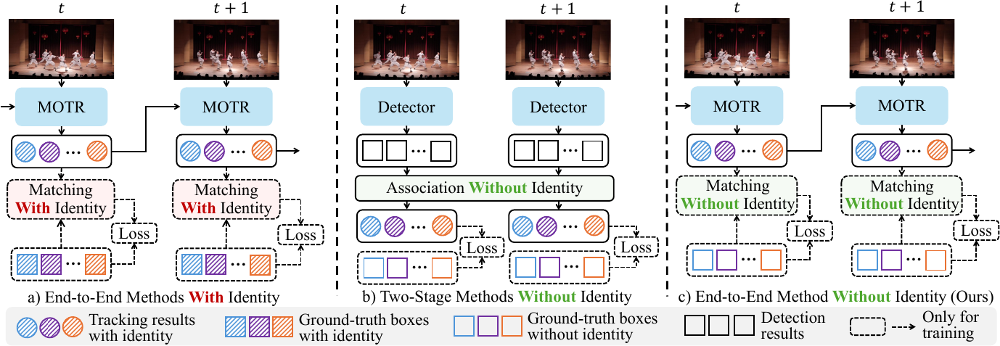
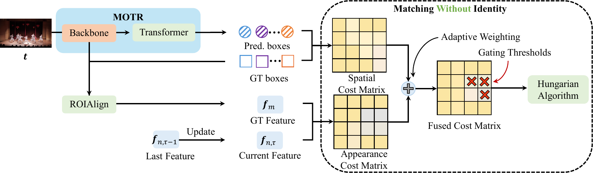

# IFMOT: End-to-End Multi-Object Tracking without Identity Supervision

<div align="center">

[](https://doi.org/10.1016/j.patcog.2026.114698)
[](LICENSE)

Official PyTorch implementation of **End-to-End Multi-Object Tracking without Identity Supervision**.

Wenbo Ma, Qiankun Liu, Junbao Zhuo, Jiansheng Chen, Huimin Ma

</div>

## Overview

IFMOT trains an end-to-end, query-based multi-object tracker without using annotated object identities from real video clips. It addresses the missing query-to-object correspondence with two components:

- **Hierarchy Matching Strategy (HMS):** consists of Matching with Gated Filtering (MGF), Dynamic Fusion Cost (DFC), and State-aware Update of Appearance Feature (SUAF).
- **Neglecting Loss (NL):** does not immediately classify a temporarily unmatched tracking query as background, reducing premature track termination under occlusion.

This repository contains the IFMOT integration built on [MOTR](https://github.com/megvii-research/MOTR). The paper also reports an IFMOT-MOTRv2 integration; that implementation is not included in this release.

<p align="center">
  
</p>

## Method

### Hierarchy Matching Strategy

HMS contains three modules: **Matching with Gated Filtering (MGF)**, **Dynamic Fusion Cost (DFC)**, and **State-aware Update of Appearance Feature (SUAF)**.

#### Matching with Gated Filtering (MGF)

MGF establishes query-to-object correspondence in three steps. First, ground-truth boxes are assigned to tracking predictions using DFC, and unreliable matches are removed by spatial and appearance gates. Second, the unmatched ground-truth boxes are assigned to the remaining tracking predictions, while only matches passing the spatial gate are retained. Finally, the still-unmatched ground-truth boxes are assigned to all detection predictions to initialize new tracks.

#### Dynamic Fusion Cost (DFC)

DFC combines spatial and appearance information for matching. The fusion weight is determined by the difference between the two largest appearance similarities: a distinctive appearance match receives more weight, whereas an ambiguous one relies more strongly on spatial information.

$$
\mathcal{C}_{\mathrm{fusion}}=(1-\alpha)\mathcal{C}_{\mathrm{spa}}+\alpha\mathcal{C}_{\mathrm{app}},
\qquad
\alpha=s_{\mathrm{top1}}-s_{\mathrm{top2}}.
$$

#### State-aware Update of Appearance Feature (SUAF)

SUAF prevents unreliable observations from corrupting a track's appearance representation. The appearance feature is updated by exponential moving average only when the cosine similarity between the current observation and the stored track feature exceeds $\epsilon_{\mathrm{feat}}$. The paper uses $\beta=0.9$ and $\epsilon_{\mathrm{feat}}=0.6$.

### Neglecting Loss

NL avoids immediately treating an unmatched tracking query as background. Its classification loss is ignored within a short temporal tolerance window, reducing premature track termination caused by occlusion. The paper uses $\epsilon_{\mathrm{unmatch}}=3$.

<p align="center">
  
</p>

## Main results

The following test-set results are reported in the paper for the MOTR-based implementation. Training uses bounding boxes but no ground-truth identities from the real video clips.

| Dataset | HOTA | AssA | DetA | IDF1 | MOTA | IDS |
|---|---:|---:|---:|---:|---:|---:|
| DanceTrack | 53.8 | 38.0 | 76.5 | 52.3 | 85.6 | - |
| MOT17 | 55.1 | 53.2 | 57.5 | 66.7 | 71.2 | 2,037 |

## Installation

The code was developed for Linux with CUDA. Python 3.8+ is recommended. Install mutually compatible PyTorch and torchvision builds for your CUDA version; the augmentation code uses the `torchvision.datapoints` API available in torchvision 0.15.x.

```bash
conda create -n ifmot python=3.8 -y
conda activate ifmot

# Install PyTorch and torchvision for your CUDA version first.
pip install -r requirements.txt

cd models/ops
sh make.sh
python test.py
cd ../..
```

Download the COCO-pretrained ResNet-50 Deformable DETR checkpoint from the [Deformable DETR model zoo](https://github.com/fundamentalvision/Deformable-DETR) before starting Stage 1.

## Data preparation

Download [MOT17](https://motchallenge.net/data/MOT17/), [DanceTrack](https://github.com/DanceTrack/DanceTrack), and [CrowdHuman](https://www.crowdhuman.org/). Convert MOT17 and CrowdHuman annotations to the normalized FairMOT/JDE `labels_with_ids` format.

The training code expects a root directory similar to:

```text
<MOT_DATA_ROOT>/
├── MOT17/
│   └── images/
│       ├── train/<sequence>/img1/
│       └── test/<sequence>/img1/
├── MOT17_labels_with_ids/
│   └── train/<sequence>/img1/
├── crowdhuman/
│   └── Images/
├── crowdhuman_labels_with_ids/
│   ├── train/
│   └── val/
└── DanceTrack/
    ├── train/<sequence>/
    │   ├── img1/
    │   └── gt/gt.txt
    └── test/<sequence>/img1/
```

The relative image lists used by MOT17/CrowdHuman are stored in `datasets/data_path/`. If your layout differs, regenerate or override the lists with `TRAIN_LIST` and `VAL_LIST`.

## Training

Training follows the two-stage procedure described in the paper:

- **Stage 1:** create pseudo video clips by applying different augmentations to copies of one frame. The copied objects provide pseudo identities for supervised initialization.
- **Stage 2:** fine-tune on real video clips after independently shuffling identities in every frame; cross-frame identity annotations are therefore unavailable to the matcher.

All scripts default to eight GPUs with batch size 1 per GPU. Override `NPROC_PER_NODE` if needed.

### MOT17

Stage 1 uses MOT17 and CrowdHuman; Stage 2 uses MOT17 only.

```bash
export MOT_DATA_ROOT=/path/to/datasets
export PRETRAINED=/path/to/r50_deformable_detr-checkpoint.pth
bash configs/ifmot_pretrain_mot17.sh

unset PRETRAINED
bash configs/ifmot_train_mot17.sh
```

To use a different Stage-1 checkpoint or output directory:

```bash
PRETRAINED=/path/to/stage1/checkpoint.pth \
OUTPUT_DIR=exps/my_ifmot_mot17 \
bash configs/ifmot_train_mot17.sh
```

### DanceTrack

No external training data are used for DanceTrack.

```bash
export MOT_DATA_ROOT=/path/to/datasets
export PRETRAINED=/path/to/r50_deformable_detr-checkpoint.pth
bash configs/ifmot_pretrain_dancetrack.sh

unset PRETRAINED
bash configs/ifmot_train_dancetrack.sh
```

The paper uses AdamW with an initial learning rate of `2e-4`, random temporal intervals from 1 to 10, and clip lengths that grow from 2 to 5 frames. The supplied scripts reproduce these schedules.

## Evaluation and submission

Generate MOTChallenge-format result files with:

```bash
MOT_DATA_ROOT=/path/to/datasets \
CHECKPOINT=exps/ifmot_mot17/checkpoint.pth \
bash configs/ifmot_submit_mot17.sh
```

```bash
MOT_DATA_ROOT=/path/to/datasets \
CHECKPOINT=exps/ifmot_dancetrack/checkpoint.pth \
bash configs/ifmot_submit_dancetrack.sh
```

Results are written under `OUTPUT_DIR/EXP_NAME` (for example, `outputs/ifmot_mot17/submission`). Evaluate them with the official [TrackEval](https://github.com/JonathonLuiten/TrackEval) protocol or submit them to the corresponding benchmark server.

## Acknowledgements

This project builds on [MOTR](https://github.com/megvii-research/MOTR), [Deformable DETR](https://github.com/fundamentalvision/Deformable-DETR), and the FairMOT/JDE data preparation format. We thank their authors for releasing their code.

## Citation

```bibtex
@article{ma2026ifmot,
  title   = {End-to-End Multi-Object Tracking without Identity Supervision},
  author  = {Ma, Wenbo and Liu, Qiankun and Zhuo, Junbao and Chen, Jiansheng and Ma, Huimin},
  journal = {Pattern Recognition},
  year    = {2026},
  doi     = {10.1016/j.patcog.2026.114698}
}
```

## License

This repository is released under the [Apache License 2.0](LICENSE).
